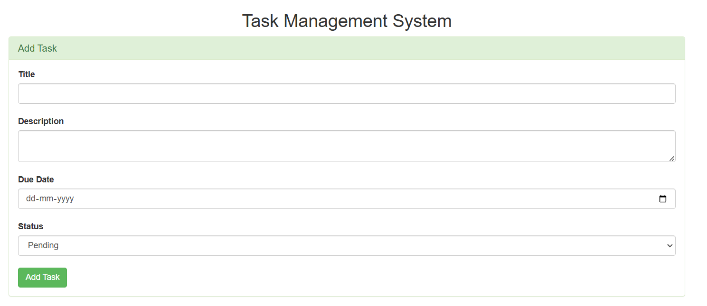
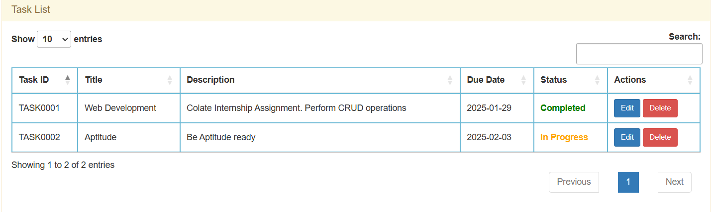
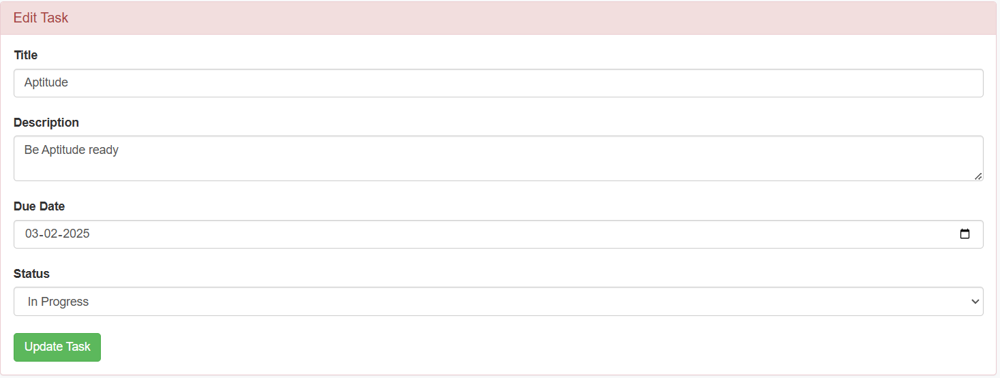

# Task Management Application

## Overview
This is a simple Task Management Application built using PHP, MySQL, and Bootstrap. It allows users to perform CRUD (Create, Read, Update, Delete) operations on tasks. The application features a responsive front-end interface and a back-end API to handle task-related operations.

## Features

### Create Tasks:
- Add tasks with a title, description, due date, and status.
- Status defaults to "Pending".

### View Tasks:
- View a list of all tasks in a responsive table.
- Tasks are color-coded based on their status:
  - **Pending:** Red
  - **In Progress:** Orange
  - **Completed:** Green

### Update Tasks:
- Edit task details (title, description, due date, and status).

### Delete Tasks:
- Delete tasks with a confirmation prompt.

### API Integration:
- The front-end communicates with the back-end using RESTful APIs.

## Technologies Used

### Front-end:
- HTML, CSS, JavaScript
- Bootstrap (for styling)
- DataTables (for table functionality)

### Back-end:
- PHP
- MySQL (for database)

### APIs:
- `create_task.php`: Handles task creation.
- `update_task.php`: Handles task updates.
- `delete_task.php`: Handles task deletion.

## Setup Instructions

### Prerequisites
#### Web Server:
- Install a local web server like XAMPP, WAMP, or MAMP.
- Ensure PHP and MySQL are enabled.

#### Database:
1. Create a MySQL database named `task_manager`.
2. Run the following SQL query to create the `tasks` table:

```sql
CREATE TABLE tasks (
    id INT AUTO_INCREMENT PRIMARY KEY,
    task_id VARCHAR(20) NOT NULL,
    title VARCHAR(255) NOT NULL,
    description TEXT,
    due_date DATE NOT NULL,
    status ENUM('Pending', 'In Progress', 'Completed') DEFAULT 'Pending',
    created_at TIMESTAMP DEFAULT CURRENT_TIMESTAMP
);
```

### Clone the Repository:
Clone this repository into your web server's root directory (e.g., `htdocs` for XAMPP).

```bash
git clone https://github.com/your-username/task-manager.git
```

### Configure Database Connection:
Open `config.php` and update the database credentials:

```php
$host = 'localhost';
$db   = 'task_manager';
$user = 'root';
$pass = '';
```

## Running the Application
1. Start your local web server and MySQL server.
2. Open your browser and navigate to:

```
http://localhost/task-manager/index.php
```

3. Use the application to create, view, update, and delete tasks.

## API Endpoints

### Create Task:
- **URL:** `api/create_task.php`
- **Method:** `POST`
- **Request Body:**

```json
{
  "title": "Task Title",
  "description": "Task Description",
  "due_date": "2023-12-31",
  "status": "Pending"
}
```

- **Response:**

```json
{
  "success": true
}
```

### Update Task:
- **URL:** `api/update_task.php`
- **Method:** `POST`
- **Request Body:**

```json
{
  "id": 1,
  "title": "Updated Title",
  "description": "Updated Description",
  "due_date": "2023-12-31",
  "status": "In Progress"
}
```

- **Response:**

```json
{
  "success": true
}
```

### Delete Task:
- **URL:** `api/delete_task.php`
- **Method:** `POST`
- **Request Body:**

```json
{
  "id": 1
}
```

- **Response:**

```json
{
  "success": true
}
```

## File Structure

```
task-manager/
│
├── Assets/
│   └── bootstrap.min.css
│
├── api/
│   ├── create_task.php
│   ├── update_task.php
│   └── delete_task.php
│
├── config.php
├── index.php
├── update_task.php
├── delete_task.php
└── README.md
```

## Screenshots




## Video Demo
[Watch Demo Video](videos/Task_Manager.mp4)
